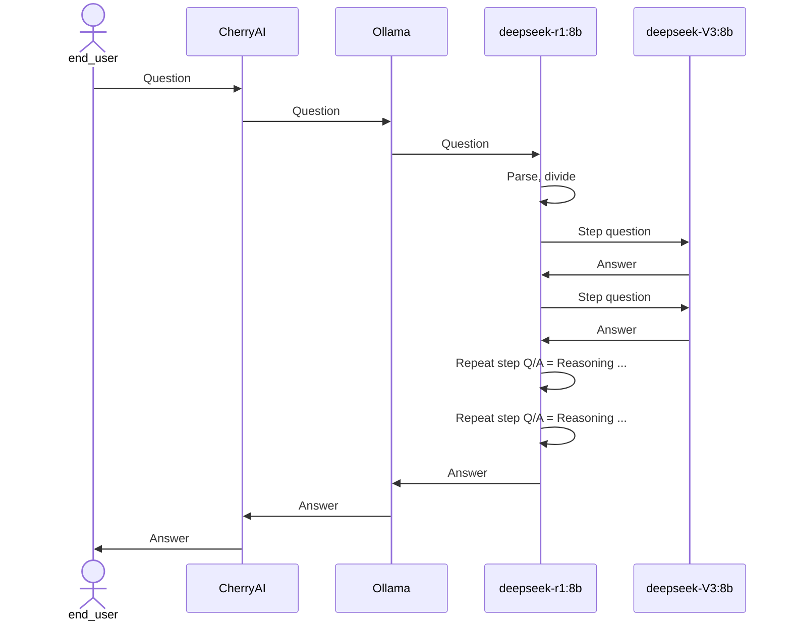

# Run deepseek-R1 locally

`Deepseek` LLMs (large language model) significantly reduced the resource requirements for both training and running LLMs, we can even run them on our Mac now.

Background: Just google "deepseek shake up AI technology" (with parenthesis)

We need 3 pieces to run LLM locally:
- LLM itself, we'll run a smaller version called `deepseek-r1:8b`;
- A server hosting LLM, we'll use `Ollama`;
- A client (user interface) to interact with the hosting server, we'll use `CherryAI`.

Following are detail steps.

## 1. Download and Install Ollama
`Ollama` is a server to host LLMs.

Go to
https://ollama.com
Then click the `Download` button, then click `Download for macOS`.

Once downloaded
- open Finder and go $HOME/Downloads,
- double click "Ollama-darwin.zip"
- double click "Ollama.app", Ollama will run in background, a icon will appear on the top Mac menu.

## 2. Pull Deepseek-r1:8b model via Ollama

Open Terminal, enter the following Shell command

    ollama pull deepseek-r1:8b

Note: I got this command by
- going to https://ollama.com/library/deepseek-r1,
- select "8b",
- click "Copy" icon,
- replace "run" with "pull"

This model has 8 billion parameters, its size is 4.9 GB only, our Mac has more than 16 GB memory.

## 3 Install CherryAI
This is the UI (user interface) you use to interact with servers hosting LLM, we are going to use it to interact with `Ollama`.
https://cherry-ai.com/download

Then click the first big red button (下载Apple芯片)

Once downloaded
- open Finder and go $HOME/Downloads,
- double click "Cherry-Studio-0.9.21-arm64.dmg"

## 4 Configure CherryAI
Configure `deepseek-r1:8b` in `CherryAI` ([Screeshot](configCherryAI.png)):
- In `CherryAI`, click the Settings icon at left bottom;
- Click `Ollama`;
- Click the green button "Manage" at lower part, you will see "Ollama Models" dialog;
- Click the green button "+" at the end right of "deepseek-r1:8b";
- Close the "Ollama Models" dialog;
- Click the "Chat" icon at top left (second from top);
- Click the model icon next to "Default Assistant" at top；
- Select "deepseek-r1:8b";
- Now you can type questions at bottom, enjoy!

## Notes

Based on https://youtu.be/ZHm9IJQig4c?t=19
